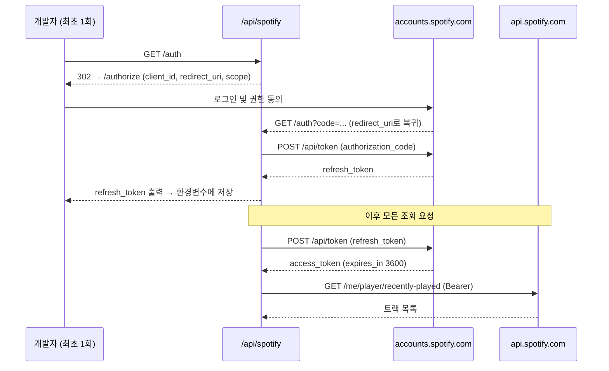

# Spotify 인증 및 API 연결 구조

최근 재생한 트랙을 HTML 카드로 렌더링해 외부에 노출하는 기능이다. Spotify Web API를 호출하려면 사용자 단위 인가가 필요하고, 서버에는 사용자가 없으므로 **한 번만 수동으로 인증해 refresh token을 확보한 뒤 환경변수로 보관**하는 방식을 쓴다.

## 파일 구성

| 파일                                                                            | 역할                                                  |
| ------------------------------------------------------------------------------- | ----------------------------------------------------- |
| [src/app/api/[...route]/route.ts](../src/app/api/%5B...route%5D/route.ts)       | Hono 앱을 `/api`에 마운트하고 Next.js 핸들러로 내보냄 |
| [src/app/api/[...route]/spotify.tsx](../src/app/api/%5B...route%5D/spotify.tsx) | `/api/spotify/*` 라우트 (`/auth`, `/playing`)         |
| [src/lib/spotify/utils.ts](../src/lib/spotify/utils.ts)                         | 토큰 발급 및 Web API 호출                             |
| [src/lib/spotify/html.tsx](../src/lib/spotify/html.tsx)                         | 트랙을 HTML 카드로 렌더링 (hono/jsx + hono/css)       |
| [src/lib/spotify/html.styles.ts](../src/lib/spotify/html.styles.ts)             | 카드 스타일 정의                                      |
| [src/lib/spotify/satori.tsx](../src/lib/spotify/satori.tsx)                     | 트랙을 SVG로 렌더링 — **현재 미사용**                 |

라우트는 `route.ts`에서 `app.route('/spotify', spotify)`로 연결되며, 앱 basePath가 `/api`라서 최종 경로는 `/api/spotify/*`가 된다. 같은 파일의 `export const dynamic = 'force-dynamic'`이 전체 API 라우트의 정적 캐싱을 끈다.

## 환경변수

| 이름                     | 용도                                                                         |
| ------------------------ | ---------------------------------------------------------------------------- |
| `SPOTIFY_CLIENT_ID`      | 앱 식별자. Basic 인증과 authorize 요청에 사용                                |
| `SPOTIFY_CLIENT_SECRET`  | 앱 시크릿. Basic 인증에 사용                                                 |
| `SPOTIFY_TOKEN_ENDPOINT` | `https://accounts.spotify.com/api/token`                                     |
| `SPOTIFY_REDIRECT_URI`   | 인가 코드를 돌려받을 주소. 대시보드 등록값과 **문자열이 완전히 일치**해야 함 |
| `SPOTIFY_REFRESH_TOKEN`  | `/auth`로 1회 획득한 갱신 토큰. 이후 모든 호출의 기반                        |

`redirect_uri`는 loopback을 제외하면 Spotify가 HTTPS를 강제한다. 로컬에서 인가 코드를 직접 받으려면 `localhost`가 아니라 명시적 루프백 IP(`http://127.0.0.1:3000/api/spotify/auth`)를 등록해야 한다.

## 인증 구조

OAuth 2.0 Authorization Code Grant를 쓰되, 코드 교환 단계는 최초 1회만 사람이 수행한다.

### 1단계 — refresh token 획득 (수동, 1회)

`GET /api/spotify/auth`는 쿼리스트링의 `code` 유무로 두 가지 역할을 겸한다.

- **`code` 없음**: `client_id`, `response_type=code`, `redirect_uri`, `scope`를 붙여 `https://accounts.spotify.com/authorize`로 리다이렉트한다.
- **`code` 있음**: Spotify가 인가 후 되돌려준 상태다. 해당 코드를 `grant_type=authorization_code`로 토큰 엔드포인트에 교환하고, 응답의 `refresh_token`을 화면에 출력한다.

출력된 값을 `SPOTIFY_REFRESH_TOKEN`에 넣으면 준비가 끝난다. 인가 코드는 일회용이라 이 과정을 매 요청마다 반복할 수는 없다.

요청하는 scope:

```
user-read-currently-playing user-read-recently-played user-top-read
```

### 2단계 — access token 발급 (요청마다 자동)

`getAccessToken()`이 `grant_type=refresh_token`으로 토큰을 받아온다. 인증 방식은 client credentials를 Basic 헤더에 싣는 형태다.

```
Authorization: Basic base64(CLIENT_ID:CLIENT_SECRET)
Content-Type: application/x-www-form-urlencoded

grant_type=refresh_token&refresh_token=...
```

`basic` 상수는 모듈 최상위에서 `Buffer`로 계산되므로 이 모듈은 Node 런타임을 전제한다. Edge 런타임으로 옮기면 동작하지 않는다.

### 전체 흐름



## 엔드포인트

| 경로                       | 동작                                                         |
| -------------------------- | ------------------------------------------------------------ |
| `GET /api/spotify/auth`    | refresh token 발급용. 위 1단계 참조                          |
| `GET /api/spotify/playing` | 최근 재생 트랙 1건을 HTML 카드로 반환. 실패 시 문자열 `NULL` |

`/playing`은 `getRecentlyPlayed()`로 `/me/player/recently-played`를 호출해 `items[0].track`을 꺼내고, `getHtml(track)`으로 카드를 만든다. 앨범 아트, 트랙명, 아티스트명 각각이 Spotify 링크로 연결된 구조다.

`getCurrentTrack()`은 `/me/player/currently-playing`을 호출하는 함수로 남아 있으나 현재 라우트에서 쓰이지 않는다. 재생 중이 아닐 때 204를 반환해 카드가 비어버리는 문제 때문에 `getRecentlyPlayed()`로 교체된 이력이 있다(커밋 `7f4310f`).

## 알려진 제약과 주의사항

**토큰 캐싱이 없다.** `/playing` 요청 한 건마다 토큰 발급 왕복이 한 번씩 추가로 발생한다. access token의 수명은 3600초이므로, 만료 시각과 함께 메모리나 외부 스토어에 캐싱하면 지연과 호출량을 모두 줄일 수 있다.

**토큰 발급 실패가 드러나지 않는다.** `getAccessToken()`이 `response.ok`를 검사하지 않고 응답 본문을 그대로 `AccessToken`으로 캐스팅한다. 발급이 400으로 실패하면 `access_token`이 `undefined`가 되고, 이어지는 API 호출이 `Bearer undefined`로 나가 401을 받으며, 최종적으로 화면에는 `NULL`만 남는다. 원인 추적이 불가능하므로 상태 코드 검사와 에러 로깅을 추가하는 편이 좋다.

**refresh token은 만료되지 않지만 폐기될 수 있다.** 비밀번호 변경, 앱 권한 회수, 대시보드에서의 앱 설정 변경 등으로 무효화되면 `invalid_grant` / `Refresh token revoked`가 반환된다. 이 경우 1단계를 다시 수행해야 한다.

**환경변수는 로컬과 배포본을 함께 갱신해야 한다.** `.env.local`은 Vercel CLI가 내려받은 사본이므로 로컬만 고치면 배포본에 반영되지 않는다.

```
vercel env rm  SPOTIFY_REFRESH_TOKEN production
vercel env add SPOTIFY_REFRESH_TOKEN production
```

## 재발급 절차

1. Spotify Developer Dashboard의 Redirect URIs에 `SPOTIFY_REDIRECT_URI`와 동일한 문자열이 등록되어 있는지 확인한다.
2. `/api/spotify/auth`에 접속해 인증을 완료하고, 출력된 refresh token을 복사한다.
3. `.env.local`과 Vercel 환경변수의 `SPOTIFY_REFRESH_TOKEN`을 갱신한다.
4. `/api/spotify/playing`이 `NULL` 대신 카드를 반환하는지 확인한다.
