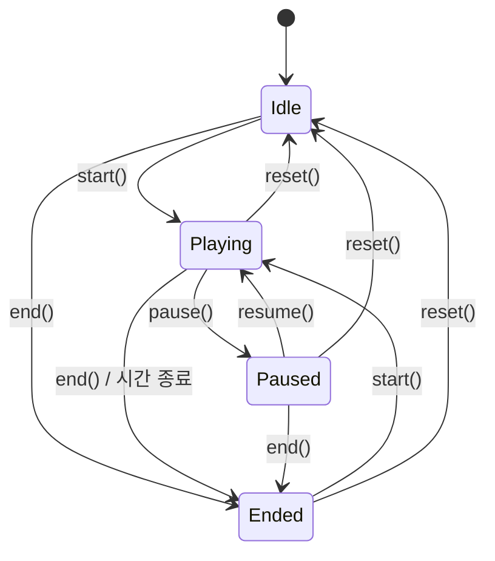

# @eunsoolib/mole

두더지 잡기 게임 엔진입니다. 스포너·타이머·점수·랭킹을 각각의 클래스로 나누고 `MoleGameManager`가 이들을 조립합니다.

UI 없이 게임 규칙만 모델링한 설계 실험입니다. 격자 크기와 두더지 수를 설정으로 받고, 60초 동안 1초마다 두더지를 무작위 위치에 띄우며, 남은 시간이 줄수록 두더지가 보이는 시간도 짧아집니다. 렌더링과 클릭 판정은 콜백을 받는 쪽이 담당합니다.

## 설치

```bash
pnpm add @eunsoolib/mole
```

## 사용법

```ts
import {
  GameConfig,
  GameState,
  MoleGameManager,
  RankManager,
} from '@eunsoolib/mole'

const ranks = new RankManager()

const game = new MoleGameManager({
  config: new GameConfig(3, 3, 3), // 3x3, 한 번에 3마리
  onTick: (remaining) => renderTimer(remaining),
  onSpawn: (indexes, visibility) => showMoles(indexes, visibility),
  onScoreUpdate: (score, rank) => renderScore(score, rank),
  onStateChange: (state) => {
    if (state === GameState.Ended) ranks.add(game.getScore(), game.getRank())
  },
})

game.start()

// 보이는 두더지를 클릭했을 때 (판정은 호출하는 쪽 책임)
game.hit() // 기본 10점
```

`onSpawn`의 `indexes`는 `0 ~ row * col - 1` 범위의 중복 없는 칸 번호이고, `visibility`는 두더지를 보여줄 시간(ms)입니다.

## API

### `new GameConfig(row, col, moleCount)`

격자 설정. 조건을 어기면 생성자에서 `Error`를 던집니다.

- `row`, `col`: `GameConfig.MIN_SIZE`(2) ~ `GameConfig.MAX_SIZE`(6)
- `moleCount`: `1` 이상, `Math.floor(row * col / 2)` 미만

`totalSlots`(= `row * col`), `clone()`, 정적 메서드 `GameConfig.isValidSize(row, col)`를 제공합니다.

### `GameState`

`Idle` · `Playing` · `Paused` · `Ended` 문자열 enum.

### `new MoleGameManager(options)`

| 옵션            | 타입                                              | 설명                        |
| --------------- | ------------------------------------------------- | --------------------------- |
| `config`        | `GameConfig`                                      | 필수                        |
| `onTick`        | `(remainingTime: number) => void`                 | 1초마다 남은 초             |
| `onTimeout`     | `() => void`                                      | 시간 종료 (`Ended` 전환 후) |
| `onScoreUpdate` | `(score: number, rank: string) => void`           | `hit()` 직후                |
| `onSpawn`       | `(indexes: number[], visibility: number) => void` | `Playing`일 때만 호출       |
| `onStateChange` | `(state: GameState) => void`                      | 상태가 바뀔 때마다          |

| 메서드                                                              | 설명                                                |
| ------------------------------------------------------------------- | --------------------------------------------------- |
| `start()`                                                           | `Idle`/`Ended`에서만 동작. 점수·타이머(60초) 초기화 |
| `pause()` / `resume()`                                              | 타이머와 스포너를 멈추고 다시 시작                  |
| `end()`                                                             | `Ended`로 전환                                      |
| `reset()`                                                           | `Idle`로 전환하고 타이머·점수 초기화                |
| `hit(points = 10)`                                                  | `Playing`일 때만 점수 추가                          |
| `getScore()` / `getRank()` / `getRemainingSeconds()` / `getState()` | 현재 값 조회                                        |
| `getConfig()`                                                       | 설정의 복사본                                       |

### 구성 요소 (단독 사용 가능)

- **`new MoleSpawner({ totalSlots, spawnCount, getRemainingSeconds?, onSpawn })`** — `start()` / `stop()` / `updateDelay(ms)`. 기본 1000ms마다 Fisher-Yates로 칸을 고르고, 보이는 시간은 `300 + 1200 × (남은 초 / 60)`ms(0~1로 clamp, `getRemainingSeconds`가 없으면 60초로 간주).
- **`new PauseableTimer(totalSeconds, onTick?, onTimeout?)`** — 1초 단위 카운트다운. `start()` / `pause()` / `resume()` / `reset()` / `isRunning()` / `isTimeout()` / `getRemainingSeconds()` / `getProgress()`(남은 비율 %).
- **`new ScoreManager(initialScore = 0)`** — `add(point)` / `getScore()` / `resetScore()` / `getRank()`(`{ name, point }`) / `getRankName()`.
- **`new RankManager()`** — 메모리 내 상위 10개 기록. `add(score, rank)` / `getTop10()`(점수 내림차순 `RankEntry[]` 복사본) / `reset()`.

## 설계 노트

### 상태 전이



허용되지 않은 호출(예: `Idle`에서 `pause()`)은 조용히 무시됩니다. `reset()`은 상태와 무관하게 항상 `Idle`로 보냅니다.

### 규칙

- 랭크 기준: `S` ≥ 100, `A` ≥ 70, `B` ≥ 40, `C` ≥ 10, 그 외 `D`
- 타이머는 남은 시간이 0이 된 **다음 틱**에 `onTimeout`을 부르므로, 60초 게임은 약 61초 시점에 `Ended`가 됩니다.
- 타이머·스포너 모두 `setInterval` 기반이라 일시정지하면 진행 중이던 1초 미만 구간은 버려집니다.
- `RankManager`는 `MoleGameManager`와 연결되어 있지 않고, 영속화도 하지 않습니다. 게임 종료 시 직접 기록합니다.
